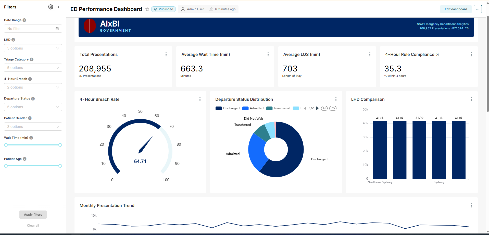
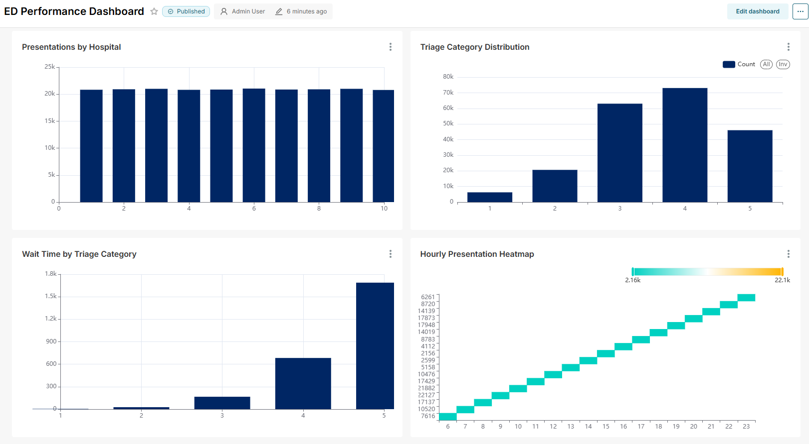
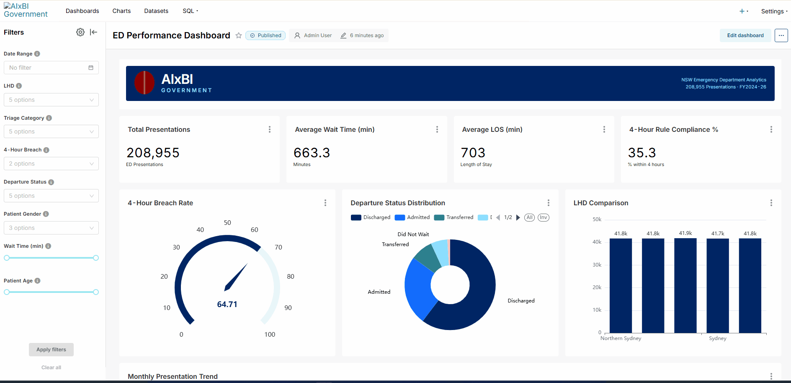
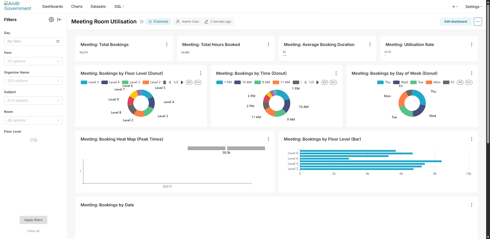

# Superset × Claude MCP — Healthcare ED Dashboard

> **An AI-automated BI dashboard: Apache Superset + Claude MCP builds charts, configures RLS, and deploys — all from natural language.**

[](https://superset.apache.org/)
[](https://claude.ai/)
[](https://docs.docker.com/compose/)
[](https://www.postgresql.org/)

---

## What This Is

A complete Healthcare Emergency Department dashboard built **entirely through AI automation**. No manual chart creation, no clicking through UI wizards — Claude Code talks to Superset via MCP to:

1. **Create datasets** from PostgreSQL tables
2. **Build 12+ charts** (bar, line, heatmap, gauge, pie)
3. **Assemble dashboard layouts** with filters and cross-links
4. **Configure Row-Level Security** so each user sees only their authorised data
5. **Export everything as code** (JSON + Git versioned)

## Architecture

```
┌─────────────────────┐
│   PostgreSQL 16     │  200K+ synthetic ED records
│   (healthcare_db)   │  Star schema: fact_ed_visits + 4 dims
└────────┬────────────┘
         │ SQLAlchemy
┌────────▼────────────┐
│   Apache Superset   │  Dashboard engine
│   (Docker Compose)  │  Native RLS, RBAC, 60+ chart types
└────────┬────────────┘
         │ MCP Server (built-in, Superset 5.0+)
┌────────▼────────────┐
│   Claude Code /     │  Natural language → API calls
│   Claude Desktop    │  "Create a bar chart of wait times
└─────────────────────┘   by triage category from ed_visits"
```

## Dashboard Pages

### ED Performance Overview
KPI cards (presentations, ALOS, 4-hour rule %), monthly trend lines, LHD comparison bars.

### Triage & Wait Times
Wait time distributions by triage category, hourly presentation heatmaps, breach rate gauges.

### Capacity & Flow
Bed occupancy by ward type, patient flow Sankey diagrams, time-to-admission tracking.

### Preview





## Row-Level Security

Three roles with automatic data filtering:

| Role | Sees | Filter |
|------|------|--------|
| Admin | All LHDs, all wards | No filter |
| LHD Manager | Their LHD only | `lhd_name = {{current_user.lhd}}` |
| Ward Nurse | Their ward only | `ward_id = {{current_user.ward}}` |

RLS rules are configured programmatically via Superset's REST API (8 endpoints), not through the UI.

### RLS in Action



*Admin sees all data → LHD Manager sees Sydney only → Ward Nurse sees their ward only*

## Colour Palette

| Role | HEX | Usage |
|------|-----|-------|
| Primary | `#002664` | Main KPIs, chart series 1 |
| Secondary | `#146cfd` | Chart series 2, emphasis |
| Teal | `#2e808e` | Chart series 3, categories |
| Baby Blue | `#8ce0ff` | Chart series 4, backgrounds |
| Soft Pink | `#ffb8c1` | Accent, light warnings |
| Alert | `#630019` | Threshold breaches |
| Neutral | `#d1eeea` | Gridlines, backgrounds |

## Quick Start

```bash
git clone https://github.com/yujiyamane/superset-claude-health.git
cd superset-claude-health

# Start Superset + PostgreSQL
docker compose up -d

# Load healthcare data
python scripts/load_data.py

# Connect Claude Desktop via MCP (see docs/mcp_setup.md)
# Then ask Claude: "Create the ED Performance dashboard"
```

## Repository Structure

```
├── README.md
├── docker-compose.yml          # Superset + PostgreSQL + MCP server
├── superset/
│   ├── superset_config.py      # Superset configuration + MCP + RLS
│   ├── dashboards/             # Exported dashboard JSON (Git-versioned)
├── data/
│   ├── generate_data.py        # Synthetic ED data generator (same as Case 2)
│   └── schema.sql              # PostgreSQL schema (star schema)
├── scripts/
│   ├── load_data.py            # Data loader: CSV → PostgreSQL
│   ├── setup_rls.py            # Programmatic RLS configuration via API
│   ├── setup_roles.py          # RBAC role creation via API
│   └── apply_theme.py          # Colour palette application via API
├── tests/
│   ├── test_data_integrity.py  # Data quality checks
│   ├── test_api_endpoints.py   # Superset API availability
│   ├── test_rls_rules.py       # RLS filtering validation
│   ├── test_colour_theme.py    # Palette consistency
│   └── test_dashboard_export.py # Dashboard-as-Code validation
├── docs/
│   ├── architecture.md         # System architecture
│   ├── mcp_setup.md            # Claude MCP connection guide
│   ├── rls_guide.md            # RLS implementation details
│   └── before_after.md         # Manual vs AI-automated comparison
└── screenshots/
    ├── overview_top.png
    ├── overview_bottom.png
    └── rls_demo.gif
```

## Key Metrics

| What | Manual BI Build | AI-Automated (This Project) |
|------|----------------|----------------------------|
| Dashboard creation | 2-3 days | ~30 minutes |
| RLS configuration | 2-4 hours | ~5 minutes (scripted) |
| Theme customisation | 1-2 hours | ~2 minutes (API) |
| Reproducibility | Manual screenshots | `docker compose up` + Git |

## Tech Stack

| Layer | Tool |
|-------|------|
| Data Store | PostgreSQL 16 |
| BI Platform | Apache Superset 5.0+ |
| AI Integration | Claude MCP (Model Context Protocol) |
| Data Generation | Python (pandas, numpy, Faker) |
| Orchestration | Docker Compose |
| Version Control | Git + GitHub |
| Testing | pytest |

---

## Dashboard 2: Meeting Room Utilisation

Analysis of meeting room booking patterns across 8 floor levels and 50+ rooms.

### Key Metrics
- 50,000+ bookings analysed (2024–2026)
- ~52 minute average booking duration
- 13 rooms most active per day on average
- Peak hours: 9–11 AM and 1–2 PM



### Charts
- 4 KPI cards (Total Bookings, Hours Booked, Avg Duration, Utilisation Rate)
- 3 Donut charts (Floor Level, Time of Day, Day of Week distributions)
- Heatmap (Peak booking times by hour × day)
- 3 Bar charts (Floor level, Room name, Utilisation Rate comparisons)
- Combo chart (Bookings vs Avg Duration by Day of Week)
- Time series area (Daily booking volume 2024–2026)
- 6 Native filters (Day, Hour, Organizer, Subject, Room, Floor Level)

### Data Generation
```bash
python data/generate_meeting_data.py
python scripts/load_meeting_data.py
python scripts/create_meeting_charts.py
python scripts/create_meeting_dashboard.py
```

---

## Related Projects

| Case | Focus | Repo |
|------|-------|------|
| Case 1 | Power BI × Healthcare KPI | [powerbi-claude-health](https://github.com/yujiyamane/powerbi-claude-health) |
| Case 2 | Streamlit × ED Performance | [streamlit-claude-health](https://github.com/yujiyamane/streamlit-claude-health) |
| Case 3 | Life OS × Personal Analytics | [lifeos-claude-dashboard](https://github.com/yujiyamane/lifeos-claude-dashboard) |
| **Case 4** | **Superset × Claude MCP × RLS** | **This repo** |

## Author

**Yuji Yamane** — AI-Augmented BI Solutions Lead | AI-augmented analytics